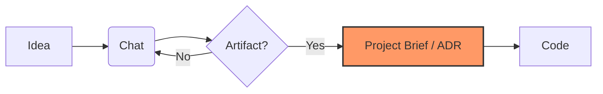
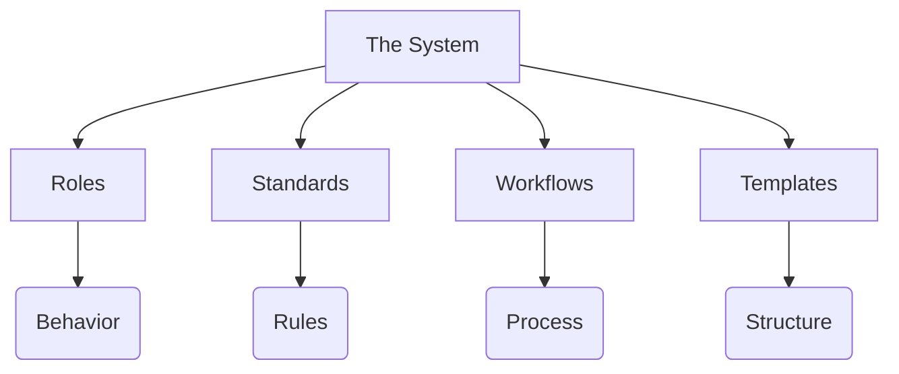

# Core Concepts

This section explains the **mental model** behind this system.

It is written for **humans**, not for AI. Reading it is optional, but it helps you understand *why* the system is structured the way it is.

:::tip Fast Track
If you want to start immediately, you can skip this section and follow **[Getting Started](../02-getting-started/index.md)**.
:::

---

## 1. The System Mental Model

This system is designed around a simple idea:

:::info Core Philosophy
**AI does not replace professional software development practices. It enforces them.**
:::

AI is treated as a **capable but literal collaborator**.
It does not hold long-term intent, architectural memory, or product context on its own.

Therefore:
- **Intent** must be explicit
- **Decisions** must be written down
- **Quality** must be enforced through structure

Speed is a by-product of clarity - not the primary goal.

---

## 2. Artifact‑Driven Development

Work in this system happens around **artifacts**, not conversations.

Artifacts are durable, inspectable documents that define intent and constraints, such as:
- Project Briefs
- Feature Descriptions
- Refactoring Plans
- Standards and Definitions of Done

**Why this matters:**
- Chat history is ephemeral.
- Artifacts survive context loss.
- Artifacts make intent auditable.

:::warning Practical Rule
If work feels unclear, the solution is usually to **create or update an artifact** — not to "explain it better in chat".
:::

---

## 3. The "contextFirst Operating System"

The system separates concerns deliberately to prevent context overload.

| Concept | Definition | Question it answers |
| :--- | :--- | :--- |
| **Roles (Agents)** | How AI thinks | "Who am I right now?" |
| **Standards** | What rules apply | "What is 'good' code?" |
| **Workflows** | How work is executed | "What is the next step?" |
| **Templates** | Which artifacts exist | "Where do I write this?" |

---

## 4. Explicit over Implicit

AI performs best when boundaries are clear, constraints are visible, and ambiguity is removed early.

**This system favors:**
*   Explicit scope over assumptions
*   Written decisions over tribal knowledge
*   Small, reviewable changes over large leaps

:::danger The Silent Killer
If AI produces inconsistent results, it usually means something important was **implicit**. Make it explicit.
:::

---

## 5. Why This Is Not Overhead

Creating artifacts and following workflows may feel slower at first.

In practice, it:
1.  Reduces rework.
2.  Prevents architectural drift.
3.  Makes refactoring safe.
4.  Keeps AI aligned over time.

The goal is not ceremony.
The goal is **sustained velocity without loss of quality**.
