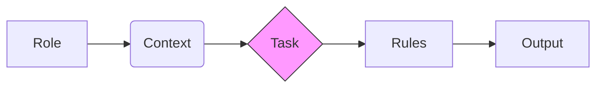

# Working with AI (Prompt Patterns)

This page provides **practical, copyable prompt patterns** for working with AI within the AI contextFirst Kit.

:::tip The "Guided Mode"
If you are using the **`.cursorrules`** (as recommended in Quickstart), you often **don't need specific prompts**.
The AI will automatically recognize when you are starting a feature and **ask you** the right questions.
:::

## 1. The First Contact
When you open a new project with this kit, a typical interaction looks like this:

> **You:** "Hi, I want to build a new SaaS project."
>
> **AI (Coach):** "👋 Welcome. I see we are in a new environment.
> I have loaded the `Project Brief` template.
> **Question:** Are we building a **Production System** (Strict) or **Prototyping** (Fast)?
>
> Please fill out `docs/project-brief.md` or let me interview you for the details."

You don't need to fear "breaking" the process. The AI is trained to guide you back to the path.

---

## 2. Context Loading

Modern AI editors (Vs Code + Copilot, Cursor, Windsurf) allow you to reference context dynamically. **Use this to save time.**

### 1. The `@component` Reference
Instead of pasting file contents, reference them if your editor supports it:
> "Act as a [Frontend Developer]. Use @Button.tsx and @ThemeContext.tsx. Refactor the button to use the theme."

### 2. The `@workspace` Command (GitHub Copilot)
To ask questions about the whole project without opening every file:
> "@workspace How is the authentication state handled in this project? Check the project-brief if unsure."

---

## 3. Core Principle

:::tip The Golden Rule of Prompting
AI performs best when its **Role**, **Context**, **Constraints**, and **Expected Outputs** are made explicit.
:::



Every prompt should clearly state:
- **Role** (Agent)
- **Context** (Documents that apply)
- **Task** (What to do)
- **Rules** (What not to do)

---

## General Prompt Structure (Recommended)

```text
Act as a <Role>.

Context:
- <Relevant documents>

Task:
- <What the AI should do>

Rules:
- <Explicit constraints>
```

Avoid conversational or open-ended prompts when working on production code or architecture.

---

## Pattern 1: Project Brief Interview

Use this pattern to create a Project Brief at the start of a new project.

```text
Act as a Requirements Engineer.

Context:
- Project Brief Template

Task:
Go through the template section by section.
Ask clarifying questions before moving on.
Summarize my answers into a complete Project Brief.

Rules:
- Do not skip sections.
- Do not invent missing information.
- Explicitly mark unknowns or assumptions.
```

---

## Pattern 2: Feature Requirements (Existing Feature File)

Use this pattern after you have deliberately created a new feature file.

```text
Act as a Requirements Engineer.

Context:
- Project Brief
- Feature Development workflow
- Definition of Done
- Existing feature file

Task:
Ask clarifying questions step by step.
Populate the feature file with:
- Feature goal
- Scope
- Non-goals
- Acceptance criteria
- Risks and assumptions

Rules:
- Do not propose solutions.
- Do not create new files.
- Do not expand scope implicitly.
```

---

## Pattern 3: Solution Design

Use this pattern once requirements are clear and agreed upon.

```text
Act as a Solution Architect.

Context:
- Feature file
- Architecture Principles
- Definition of Done

Task:
Propose solution options.
List trade-offs.
Select a preferred approach.
Update the feature file with the chosen design.

Rules:
- Do not implement code.
- Do not ignore architectural constraints.
```

---

## Pattern 4: Incremental Implementation

Use this pattern for controlled, step-by-step implementation.

```text
Act as a Developer.

Context:
- Feature file
- Architecture Principles
- Definition of Done

Task:
Implement the next minimal step to satisfy one acceptance criterion.
Include or update tests.

Rules:
- Avoid unrelated refactoring.
- Keep changes small and reviewable.
- Do not modify scope or requirements.
```

---

## Pattern 5: Completion and Validation

Use this pattern before considering work complete.

```text
Act as a QA Engineer.

Context:
- Feature file
- Definition of Done

Task:
Verify whether all acceptance criteria are met.
Check compliance with the Definition of Done.
List any remaining gaps explicitly.

Rules:
- Do not mark the feature as complete unless all criteria are satisfied.
```

---

## Pattern 6: Health Check (Optional but Recommended)

Use this pattern periodically or when the system feels harder to reason about.

```text
Act as a QA Engineer.

Context:
- Current codebase
- Health Check workflow
- Definition of Done

Task:
Assess code health, test coverage, architectural consistency, and risks.
Summarize findings and recommended actions.
```

---

## Specialized Patterns

These patterns handle specific scenarios outside the standard feature loop choices.

### Pattern 7: The Bug Hunter (Debugging)

Use this when fixing defects. It prevents the AI from "fixing" unrelated code or introducing style regressions.
See: [Defect Handling Workflow](../05-workflows/defect-handling-debugging.md)

```text
Act as a Senior Developer / Debugger.

Context:
- Defect Description / Error Log
- Relevant Source Files
- Defect Handling Workflow (Phase 2: Isolation)

Task:
Analyze the root cause of the error.
Propose a minimal fix.

Rules:
- DO NOT refactor unrelated code.
- DO NOT change code style.
- The goal is to restore function, not to improve the architecture.
- Explain WHY the fix works.
```

### Pattern 8: The Refactorer (Code Quality)

Use this when the code works but is messy.
See: [Refactoring Workflow](../05-workflows/refactoring.md)

```text
Act as a Code Maintainer.

Context:
- Target File(s)
- Refactoring Workflow
- Coding Standards

Task:
Analyze the code for complexity, duplication, or naming violations.
Apply standard refactorings (Extract Method, Rename Variable, etc.).

Rules:
- NO functional changes allowed.
- The behavior must be identical before and after.
- Ensure all tests still pass.
```

### Pattern 9: The Project Scaffolder

Use this at the very beginning of a project or module.

```text
Act as a DevOps / System Architect.

Context:
- Project Brief (Tech Stack & Architecture)
- Coding Standards (Structure)

Task:
Create the initial folder structure and configuration files.
Create empty placeholder files for key modules.

Rules:
- Do NOT implement business logic yet.
- Produce only the skeleton (folders, package.json, tsconfig, etc.).
- Ensure the structure matches the Architecture Principles.
```

---

## What to Avoid

- Open-ended prompts without constraints
- Mixing multiple roles in one prompt
- Asking AI to decide when work is complete
- Skipping documentation updates

---

## Final Note

These patterns are deliberately conservative.

They trade short-term speed for long-term clarity, control, and maintainability.

If a prompt feels restrictive, it is likely preventing a future problem.
