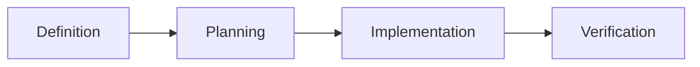

# Feature Development workflow

:::tip The Golden Rule
This workflow describes the **Theory**. The **Practice** happens in `docs/active-feature.md`.
Use this workflow to understand *how* to fill out that file.
:::

## 🚦 The Process (Simplified)



### Phase 1: Definition & Strategy
*   **Goal:** Do not write code until you know what "Done" looks like (and *why* we are doing it).
*   **Action:**
    1.  **Check Strategy (PO Mode):** If "Product Strategist Mode" is checked in `project-brief.md`:
        - **Challenge:** *"Is this feature essential right now? Can we push it to later?"*
        - **Standard Check:** *"Does a SaaS Industry Standard exist for this (e.g. Auth0 vs Custom Auth)? Should we 'Buy' instead of 'Build'?"*
    2.  **Define Scope:** Fill out sections **1 (Context)** and **2 (Acceptance Criteria)** in `active-feature.md`.
*   **Rule:** If you can't write the check-boxes, you aren't ready to code.

### Phase 2: Planning (Schema First)
*   **Goal:** Avoid "Spaghetti Code" by defining the shape of data first.
*   **Action:** Fill out section **3 (Technical Approach)**.
    *   Write the TypeScript Interfaces.
    *   Write the SQL Schema.
    *   Write the API signatures.
*   **Rule:** No implementation logic here. Just Types.

### Phase 3: Implementation (The Builder)
*   **Goal:** Execute the plan, one file at a time.
*   **Action:** 
    *   Create the file structure.
    *   Implement logic to satisfy the Interfaces.
    *   Check off items in **4 (Work Log)** as you go.

### Phase 4: Verification & Closing
*   **Goal:** prove it works.
*   **Action:**
    *   Run the tests.
    *   Fill out **5 (Verification)**.
    *   **Crucial:** Fill out **6 (Outcome)** to document trade-offs.

## 🧠 Why this works
By forcing the AI (and yourself) to update `active-feature.md` constantly, you create a "Save Point".
If the session crashes or you come back tomorrow, the Context is preserved.


:::tip 1. No Code Without Design
**Always define the API/Interface first.**
Before generating function bodies or UI components, define the TypeScript Interfaces, Python Pydantic Models, or GraphQL Schema.
:::

:::tip 2. Incremental Delivery
**Features are developed incrementally.**
Large, unstructured changes are explicitly discouraged. Break it down into testable steps.
:::

---

## Phase 1: Feature Framing

### Goal
Ensure that the feature is clearly understood before design or implementation begins.

### Questions (The "Why")
- **Alignment:** How does this feature support the `primary_goal` in the **Project Brief**?
- **User Value:** Why does the user need this *now*?
- **Impact:** What happens if we *don't* build this?

### Activities
- Restate the feature goal in precise terms
- Identify primary user value
- Define what is explicitly out of scope
- Identify risks and assumptions

### Outputs
- Feature description
- Clear scope boundaries
- Identified risks

---

## Phase 2: Requirements Definition

### Goal
Translate intent into testable requirements.

### Activities
- Use the Requirements Engineer role
- Define acceptance criteria
- Clarify edge cases and failure scenarios

### Outputs
- Structured requirements
- Acceptance criteria

---

## Phase 3: Solution Design

### Goal
Design a solution that fits the system architecture and constraints.

### Activities
- Switch to the Solution Architect role
- Propose one or more solution options
- Identify trade-offs
- Validate alignment with architecture principles

### Outputs
- Chosen solution approach
- Documented trade-offs
- Architecture Decision Record (if required)

---

## Phase 4: Incremental Implementation

### Goal
Implement the feature in small, controlled steps.

### Activities
- Switch to the appropriate Developer role
- Implement changes incrementally
- Write or update tests alongside code
- Keep each change reviewable

### Guidelines
- Prefer multiple small commits over one large change
- Avoid unrelated refactoring
- Do not expand scope during implementation

---

## Phase 5: Validation and Completion

### Goal
Ensure the feature meets all quality criteria.

### Activities
- Verify acceptance criteria
- Run automated tests
- Review against the Definition of Done
- Update documentation if needed

### Outputs
- Completed feature
- Updated documentation

---

## Completion Criteria

A feature is considered complete only if:
- All acceptance criteria are met
- The Definition of Done is fully satisfied
- The change can be explained clearly
- No undocumented assumptions remain

---

## Interaction with AI (Recommended Pattern)

```text
Act as a Solution Architect (or Requirements Engineer / Developer).

Context:
- Project Brief
- Feature Requirements / User Story
- Architecture Principles
- Definition of Done

Task:
Follow the Feature Development workflow.
[Insert specific phase goal, e.g., "Draft the Feature Description" or "Propose a Solution Design"].

Rules:
- Do not start implementation until requirements are clear.
- Do not skip architectural validation.
- Reference standards explicitly.
```

---

## Anti-Patterns

:::danger Avoid These
- **Starting without Requirements:** Starting implementation without clear intent.
- **Scope Creep:** Allowing new ideas to sneak in during coding.
- **Magic Commits:** Large, opaque AI-generated changes.
- **Skipping Validation:** Merging without checking the Definition of Done.
:::

---

## Authority

All feature work must follow this workflow.

If any phase is skipped, the resulting work is considered incomplete.

---

## Status

This workflow prioritizes correctness, clarity, and long-term maintainability over short-term speed.
