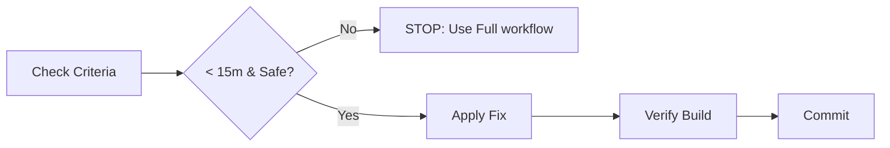

# Quick Fix Workflow

## Purpose
A simplified workflow for **trivial changes** that takes less than 15 minutes.
This prevents "process fatigue" for small tasks like typos, minor UI tweaks, or simple config updates.

## Criteria (When to use)
Use this ONLY if:
- ✅ The change is understood in < 1 minute.
- ✅ The risk of regression is near zero.
- ✅ No architectural boundaries are crossed.
- ✅ Time required is < 15 minutes.

**Examples:**
- Fixing a typo in a label.
- Changing a CSS color value.
- Adding a missing field to a type definition (if simple).
- Updating a dependency version.

---

## The Workflow

### 1. Context Assessment
Quickly verify: "Does this impact anything else?"
- If **Yes** → STOP. Use **[Feature Development](feature-development.md)** or **[Refactoring](refactoring.md)**.
- If **No** → Proceed.

### 2. Implementation
1. Locate the file.
2. Apply the change directly.
3. Verify locally (visual check or build).

### 3. Safety Check (Mini-Test)
:::warning Safety First
Even for quick fixes, don't break the build.
:::
- Run the relevant test suite (or create a trivial test case).
- Ensure `npm run build` (or equivalent) still passes.

### 4. Commit
Commit message format:
`fix: [component] description (quick-fix)`

---

## Interaction with AI

For these tasks, you do **not** need a persona or a complex prompt.

**Prompt Pattern:**
> "Fix the typo in `Button.tsx`. Change 'Submiting' to 'Submitting'. No other changes."

---

## Anti-Patterns

:::danger Avoid These
- **Trojan Horses:** Labeling a complex logic change as a "Quick Fix" to bypass review.
- **Chain Reactions:** Changing a shared utility function as a "quick fix" (this is dangerous).
- **Skipping Build:** Pushing a "quick fix" that breaks the CI pipeline.
:::
