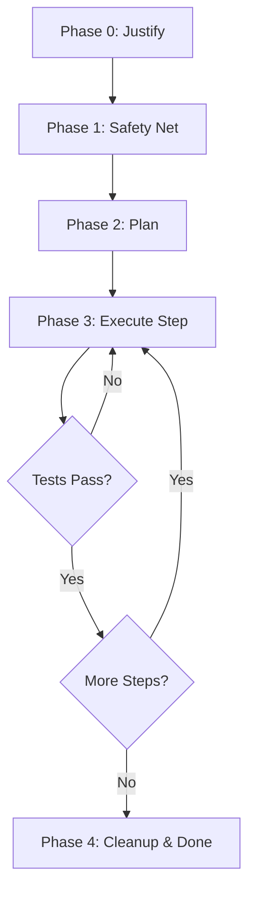

# Refactoring Playbook

## Purpose
This playbook defines a **safe, repeatable refactoring process** that preserves behavior while improving structure.

In AI-assisted development, refactoring is high-risk because large automated edits can introduce subtle regressions and architectural drift. This playbook reduces that risk through explicit planning, safety nets, and incremental execution.

### Phase 0: Prerequisite Check
**Strict Rule:** If **NO tests** exist for the target code:
*   You must **Write a Regression Test** *before* changing any functional code.
*   **Refactoring without tests is forbidden.**



## Scope
This playbook applies to:
- Structural improvements (module boundaries, naming, extraction)
- Simplification and maintainability work
- Dependency cleanup
- Testability improvements

:::info
It does **not** apply to behavior changes (see **[Feature Development](feature-development.md)**) or pure bug fixes (see **[Defect Handling](defect-handling-debugging.md)**).
:::

---

## Core Principle

:::tip Core Principle
**Refactoring changes structure, not behavior.**
If you cannot confidently prove behavior preservation, you are not refactoring — you are redesigning.
:::

---

## Inputs

:::warning Required Inputs
- Refactoring goal (why this is worth doing)
- Current code area(s) and boundaries
- Definition of Done
- Architecture Principles
:::

---

## Phase 0: Decide If Refactoring Is Justified (ROI Check)

### Goal
Avoid unnecessary refactors and "cleanup binges".

### The Business Case
- **Why Now?** Is this code blocking a new feature? Is it a frequent source of bugs?
- **Cost vs. Value:** Does the time invested (e.g., 4 hours) save at least that much time in the next 3 months?
- **Risk:** Is this a critical path? If it breaks, does the system stop working?

### Output
- A short, explicit refactoring goal statement

---

## Phase 1: Create a Safety Net

### Goal
Make regressions detectable.

### Activities
- Ensure the code builds and tests pass on the current baseline
- Add or improve automated tests that lock down behavior:
  - Unit tests for pure logic
  - Integration tests for boundaries
  - Characterization tests if behavior is unclear

### Output
- A test suite that would fail if behavior changes

> If testing is hard, treat that as a signal: improve testability first.

---

## Phase 2: Write a Refactoring Plan (Required)

### Goal
Prevent loss of direction and uncontrolled scope growth.

### Create
- `refactors/refactor-<short-name>.md` (Use the **[Refactoring Plan Template](../07-templates/refactoring-plan-template.md)**)

### Plan Content (minimum)
- Goal and non-goals
- Scope boundaries (what you will *not* touch)
- Step-by-step plan (small, mergeable steps)
- Risks and mitigation
- Validation checklist

### Output
- A written plan that can be followed without improvisation

---

## Phase 3: Execute Incrementally

### Goal
Refactor in small steps with continuous validation.

### Guidelines
- Prefer multiple small commits/PRs over one large diff
- Run relevant tests frequently
- Avoid mixing refactoring with new features
- Keep each step reviewable and explainable

### Techniques (examples)
- Rename for clarity
- Extract functions/components
- Introduce interfaces/adapters
- Move code to enforce boundaries
- Reduce duplication carefully

### Output
- Incremental structural improvements with preserved behavior

---

## Phase 4: Validation, Cleanup, and Closure

### Goal
Ensure the refactor improved the system without hidden costs.

### Activities
- Run full test suite (unit + integration)
- Run build checks and linters
- Remove temporary instrumentation or scaffolding
- Update documentation if structure changed
- Validate against Definition of Done

### Output
- A clean, validated codebase with improved structure

---

## Completion Criteria

A refactor is considered complete only if:
- Behavior is preserved and proven by tests (where feasible)
- The refactoring goal is achieved
- The codebase is at least as understandable as before
- All applicable Definition of Done criteria are satisfied

---

## Interaction with AI (Recommended Pattern)

Use AI to plan and execute refactoring, but always with constraints.

```text
Act as a Developer.

Context:
- Refactoring goal
- Refactoring Plan document
- Architecture Principles
- Definition of Done

Task:
Execute the next refactoring step exactly as described in the plan.
Keep changes minimal and reviewable.
Add or update tests as needed.

Rules:
- Do not expand scope.
- Do not change behavior.
- Do not perform unrelated cleanup.
```

---

## Anti-Patterns

:::danger Avoid These
- **Flying Blind:** Refactoring without tests.
- **Big Bang:** Large, AI-generated sweeping changes.
- **Scope Creep:** "While I'm here" changes.
- **Feature Mixing:** Mixing logic changes into refactoring.
:::

---

## Notes for React + TypeScript Projects (Optional Guidance)

- Prefer incremental component extraction over rewrites
- Use tests (e.g., Vitest) to lock down behavior before moving code
- Keep UI refactors small; isolate visual changes from structural changes
- Consider adding a lightweight smoke test for critical flows
