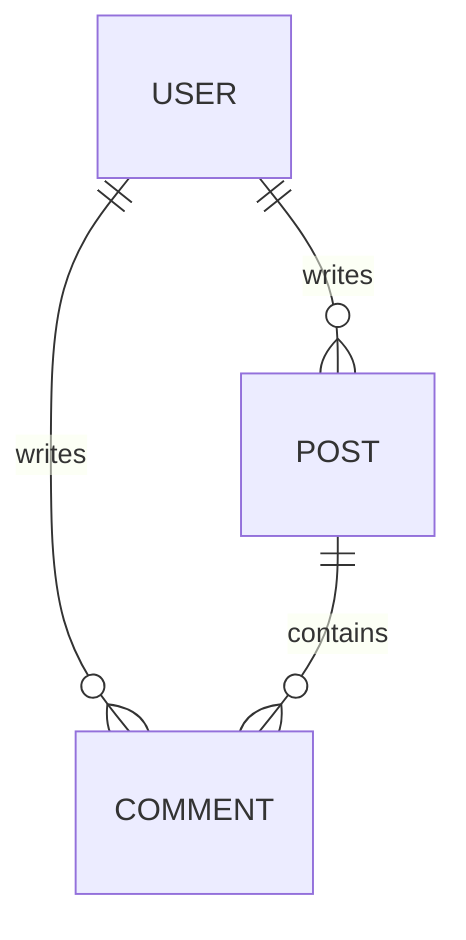

# Domain Model & Schema

## Purpose
This file is the **Source of Truth** for the project's data structure.
AI Agents must reference this file before writing SQL, Prisma schemas, or Typescript interfaces.

**Rule:** *Data precedes UI.* Define the shape here before generating components.

---

## 1. High-Level Entities (Mermaid)

---

## 2. Schema Definitions

### User
| Field | Type | Required | Description |
| :--- | :--- | :--- | :--- |
| `id` | UUID | Yes | Primary Key |
| `email` | String | Yes | Unique |
| `role` | Enum | Yes | [ADMIN, USER] |

### [Entity Name]
| Field | Type | Required | Description |
| :--- | :--- | :--- | :--- |
| ... | ... | ... | ... |

---

## 3. Key Relationships
- **User -> Workspace**: Many-to-Many (via `WorkspaceMember` table)
- **Order -> Item**: One-to-Many

## 4. Invariants & Rules
- Delete Logic: Soft delete only (add `deletedAt` column).
- Validation: Emails must be unique.
