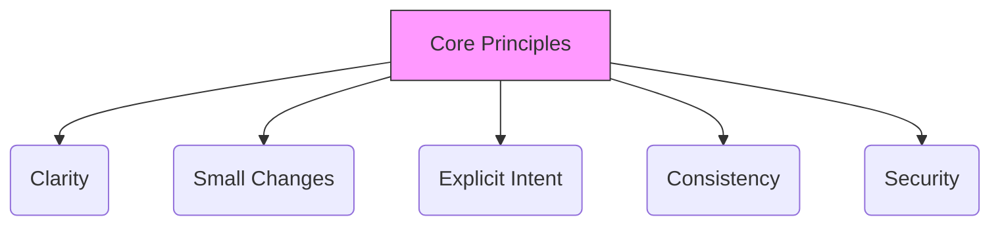

# Coding Standards

## Purpose
These standards define how code should be written to remain **enterprise-grade**: understandable, secure, maintainable, and operable over years.

They are intentionally language- and framework-agnostic.

---

## Scope
Applies to all production code, tests, scripts, and configuration.

In case of conflict, **Definition of Done** is the final gate.

---

## Core Principles

1. **Clarity over cleverness**: code is read far more often than it is written.
2. **Small, reviewable changes**: reduce risk and improve quality.
3. **Explicit intent**: avoid implicit behavior and hidden coupling.
4. **Consistency beats personal preference**: follow established patterns.
5. **Secure by default**: treat security and privacy as baseline requirements.

---

## Structure and Modularity

- Organize code into cohesive modules with clear responsibilities.
- Prefer stable public interfaces and hidden internals.
- Keep dependency direction consistent with Architecture Principles.
- Avoid cyclic dependencies.

:::tip Rule of Thumb
If a module cannot be explained in one sentence, it is likely too broad.
:::

---

## Readability and Naming

- Names must express intent (what/why), not mechanics (how).
- Prefer domain terminology over technical jargon.
- Avoid ambiguous abbreviations.
- Keep functions and components small enough to understand quickly.

---

## Complexity Management

- Prefer simple control flow.
- Avoid deep nesting and long functions.
- Introduce abstractions only when repeated pressure exists.
- Do not “design for the future” without concrete requirements.

---

## Error Handling and Fail-Safe Behavior

- Handle errors deliberately; do not silently ignore failures.
- Prefer safe defaults and explicit failure modes.
- Error messages must be clear but must not leak sensitive information.
- Classify errors where helpful (user error vs system error).

---

## Security and Privacy by Design

- Treat all external input as untrusted; validate at boundaries.
- Never commit secrets; do not log sensitive data.
- Apply least privilege thinking (explicit permissions, scoped access).
- Minimize data collection and retention.
- Keep data flows explicit: where data enters, where it is stored, where it is sent.

---

## Dependency Hygiene

- Prefer fewer dependencies with clear maintenance over many small packages.
- Avoid introducing dependencies for trivial functionality.
- Keep versions current; respond to known vulnerabilities.
- Wrap third-party integrations behind adapters where feasible.

---

## Performance and Efficiency

- Avoid premature optimization.
- Make performance decisions explicit when they matter.
- Keep expensive operations out of tight loops and UI render paths.
- Prefer algorithmic clarity; optimize only with evidence.

---

## Configuration and Environments

- Configuration must be explicit and documented.
- Separate configuration from code.
- Avoid environment-specific behavior hidden inside logic.
- Production safety: destructive operations must be guarded.

---

## Logging and Observability (Basics)

- Log intent and outcomes, not noise.
- Do not log secrets or personal data.
- Errors should be diagnosable from logs.
- Prefer structured logging where applicable.

---

## Code Review Expectations

Every change must be:
- explainable in plain language
- scoped (no unrelated changes)
- consistent with existing conventions
- supported by tests proportionate to risk

---

## CI Expectations

A change is acceptable only if:
- formatting/lint rules are satisfied (if configured)
- type checks pass (if applicable)
- tests pass
- build/package succeeds

---

## Documentation Triggers

Update documentation when:
- public behavior changes
- configuration changes
- architectural boundaries change
- a subtle invariant or edge case matters

---

## Quality Gates

A change meets Coding Standards only if:
- code is readable and consistent
- boundaries and dependency direction are respected
- error handling is deliberate
- security and privacy basics are satisfied
- CI checks pass

---

## Anti-Patterns

- “Just this once” shortcuts that become permanent
- Large diffs that mix concerns
- Hidden coupling (reaching into internals)
- Logging sensitive data
- Abstraction without pressure
- Refactoring mixed into feature work without plan
2. Testing
3. Documentation
