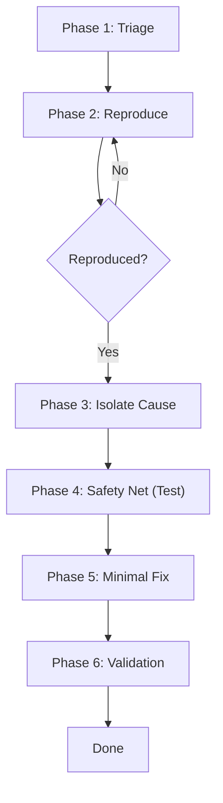

# Defect Handling & Debugging Playbook

## Purpose
This playbook defines a **repeatable process** for handling defects and debugging issues in a controlled, evidence-driven way.

In AI-assisted development, debugging can easily become chaotic (trial-and-error changes, speculative fixes, untracked regressions). This playbook prevents that by enforcing discipline.

### 🛡️ The "Stop Loss" Rule for AIs
**Strict Rule:** If the AI has tried to fix the **same bug 3 times** without success:
1.  **Stop.** Do not generate a 4th attempt.
2.  **Escalate:** Ask user for new logs/context.
3.  **Rethink:** Usually, the *Test* is wrong, not the code.



## Scope
This playbook applies to:
- Production bugs
- Test failures
- Regressions
- Unexpected behavior discovered during development

:::info
It does **not** replace incident response for large outages (see Incident Response Playbook).
:::

---

## Core Principle

:::tip Core Principle
**Debugging is an investigation, not a guessing game.**
Prefer evidence, reproduction, and minimal fixes over broad changes.
:::

---

## Inputs

:::warning Required Inputs
- Defect report (even if minimal)
- Logs, error messages, stack traces
- Steps to reproduce (if available)
- Expected vs actual behavior
:::

---

## Phase 1: Triage and Classification

### Goal
Understand severity, impact, and urgency.

### Decision Matrix (The "Stop the Bleeding" Check)
- **Critical (P0):** Data loss, Security Breach, Main Flow blocked. -> *Drop everything. Fix immediately.*
- **High (P1):** Major feature broken, no workaround. -> *Fix before next feature.*
- **Medium (P2):** Annoyance, workaround exists. -> *Schedule in next sprint/slot.*
- **Low (P3):** Visual glitch, typos. -> *Backlog.*

### Questions
- Who is affected and how badly?
- Is this a regression?
- Is data integrity at risk?
- Is there a safe workaround?

### Outputs
- Severity (Critical / High / Medium / Low)
- Impact summary
- Immediate mitigation plan (if required)

---

## Phase 2: Reproduce and Observe

### Goal
Achieve reliable reproduction and collect evidence.

### Activities
- Reproduce the issue locally or in a controlled environment
- Record exact steps
- Capture logs and relevant state
- Reduce reproduction to the smallest possible case

### Outputs
- Minimal reproduction steps
- Evidence (logs, traces, screenshots)

---

## Phase 3: Hypothesis and Isolation

### Goal
Form plausible hypotheses and narrow the cause.

### Activities
- List 2–4 plausible hypotheses (not 20)
- Identify which signals support or refute each hypothesis
- Add temporary instrumentation if needed
- Bisect recent changes if it appears to be a regression

### Outputs
- Leading hypothesis with supporting evidence
- Identified probable root cause area

---

## Phase 4: Create a Safety Net

### Goal
Prevent the defect from returning.

### Activities
- Create a failing automated test that reproduces the defect
- If testing is hard, create a characterization test or harness

### Outputs
- Failing test that demonstrates the defect

---

## Phase 5: Minimal Fix

### Goal
Fix the defect with minimal collateral impact.

### Activities
- Implement the smallest change that resolves the issue
- Avoid unrelated refactoring
- Re-run the failing test until it passes
- Run full test suite

### Outputs
- Minimal code change
- Passing tests

---

## Phase 6: Validation and Closure

### Goal
Confirm resolution and ensure quality.

### Activities
- Verify expected behavior matches requirements
- Check for regressions in adjacent areas
- Validate against Definition of Done
- Add release note entry if relevant

### Outputs
- Validation summary
- Updated documentation (if applicable)

---

## Phase 7: Knowledge Capture (The Learning Loop)

### Goal
Prevent this bug from happening in the future or in other parts of the system.

### Activity
- Ask: "Is this a recurring pattern?"
- Ask: "Did we learn a system constraint (e.g., 'Do not call API X without Header Y')?"
- **Action:** If YES, update `docs/lessons-learned.md`.

### Outputs
- Updated Project Intelligence.

---

## Completion Criteria

A defect is considered resolved only if:
- It is reproducible (or evidence is sufficient to confidently diagnose)
- A test exists that would fail without the fix (where feasible)
- The fix is minimal and reviewed against DoD
- No new regressions are introduced

---

## Interaction with AI (Recommended Pattern)

```text
Act as a QA Engineer.

Context:
- Defect description and evidence (logs, steps, stack trace)
- Definition of Done
- This Defect Handling Playbook

Task:
Guide me through triage, reproduction, hypothesis formation, and root cause isolation.
Then propose a minimal fix strategy.

Rules:
- Do not propose broad refactors.
- Do not guess without evidence.
- Prefer adding a failing test before fixing.
```

---

## Anti-Patterns

:::danger Avoid These
- **Shotgun Debugging:** Random code changes to "see if it helps".
- **Symptom Fixing:** Hiding errors instead of solving the cause.
- **Scope Creep:** Large refactors during debugging.
- **Blind Closing:** Closing without a test or clear evidence.
:::

---

## Status

This playbook is intentionally conservative.

It reduces time-to-fix by preventing chaos and regression cycles.
