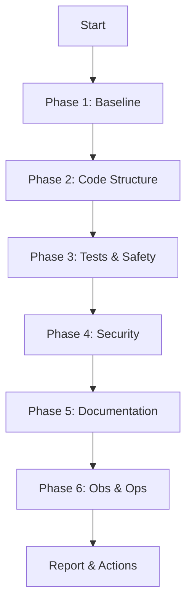

# System Health Check Playbook

## Purpose
This playbook defines a **structured, repeatable health check** for an existing codebase.

Its goal is to assess whether the system remains:
- understandable
- maintainable
- secure
- testable
- operable

A health check is **diagnostic**, not a refactoring or feature activity.



---

## When to Run a Health Check

Run a health check:
- before starting major new feature development
- after significant refactoring or architectural change
- when onboarding into an unfamiliar codebase
- when development speed or confidence noticeably degrades
- periodically (e.g. quarterly) for long‑lived projects

---

## Scope

A health check evaluates:
- code structure and boundaries
- tests and CI reliability
- security and privacy baseline
- documentation and clarity
- operational readiness (at a basic level)

:::info
It does **not** introduce changes directly. It produces a **Diagnosis**.
:::

---

## Inputs

:::warning Required Inputs
- **Project Brief (project-brief.md)** — *Crucial for alignment check*
- Current codebase
- Architecture Principles
- Definition of Done
- Applicable Standards
:::

---

## Phase 1: Alignment & Baseline Signals

### 1.1 Project Brief Alignment (Critical)
- **Goal Validity:** Is the software still solving the *Primary Goal* defined in the brief?
- **Scope Drift:** Have we accidentally implemented features listed as *Non-Goals*?
- **Constraint Check:** Are we still respecting the tech stack and compliance constraints?

### 1.2 Technical Baseline
- Does the project build successfully without manual fixes?
- Do tests run reliably?
- Are CI pipelines green?

### Red Flags
- Feature creep (solving problems not in the brief)
- Ignoring "Non-Goals"
- Frequent local setup issues
- Flaky or ignored tests

---

## Phase 2: Code Structure & Architecture

### Questions
- Are module boundaries clear and respected?
- Is dependency direction consistent?
- Are responsibilities well separated?
- Is there visible architectural drift?

### Red Flags
- God modules or oversized components
- Cross‑layer coupling
- Workarounds that bypass established boundaries

---

## Phase 3: Test & Change Safety

### Questions
- Are critical paths covered by meaningful tests?
- Can behavior changes be detected early?
- Is refactoring safe or feared?

### Red Flags
- Tests only cover happy paths
- High reliance on manual testing
- Fear of touching certain areas

---

## Phase 4: Security & Privacy Baseline

### Questions
- Are security‑sensitive areas clearly identifiable?
- Are secrets handled correctly?
- Is sensitive data treated deliberately?

### Red Flags
- Hard‑coded credentials or tokens
- Sensitive data in logs
- Authorization logic scattered or implicit

---

## Phase 5: Documentation & Clarity

### Questions
- Can a new developer understand the system at a high level?
- Are key decisions documented?
- Is documentation aligned with current behavior?

### Red Flags
- Documentation contradicts reality
- Critical knowledge lives only in code or memory

---

## Phase 6: Operational Readiness (Basic)

### Questions
- Are failures diagnosable?
- Is logging meaningful?
- Are error modes understandable?

### Red Flags
- Silent failures
- No clear way to investigate incidents

---

## Phase 7: Summary & Findings

### Produce a Health Check Report
Create:
- `health-check/health-check-<date>.md`

Include:
- overall assessment (Healthy / Degrading / Critical)
- top strengths
- top risks
- recommended follow‑up actions

---

## Follow‑Up Actions

Based on findings, decide whether to:
- proceed with feature development
- schedule refactoring (use **[Refactoring Playbook](refactoring.md)**)
- address defects (use **[Defect Handling Playbook](defect-handling-debugging.md)**)
- improve tests, documentation, or standards adherence

---

## Interaction with AI (Recommended Pattern)

```text
Act as a Senior Engineer.

Context:
- Codebase
- Architecture Principles
- Definition of Done
- Applicable Standards

Task:
Perform a structured system health check following the Health Check Playbook.
Summarize findings and risks.
Do not propose changes yet.
```

---

## Anti-Patterns

:::danger Avoid These
- **Impulsive Fixing:** Turning health checks into ad‑hoc refactoring.
- **Ignorance:** Ignoring findings because no incident occurred ("it works").
- **One-Offs:** Treating health checks as a one‑time activity rather than hygiene.
:::

---

## Outcome

A health check provides **situational awareness**.

It enables deliberate decisions instead of reactive fixes and preserves long‑term system quality.
