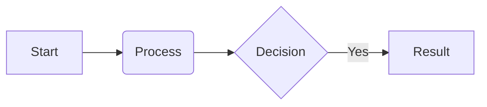

# Documentation Guide

This guide shows how to effectively use Docusaurus features to create rich documentation. We use **MDX**, which combines Markdown with React components.

## 1. Code Blocks

Always specify the language for syntax highlighting. You can also add titles and line numbers.

### Syntax

````md
```typescript title="src/agent.ts" showLineNumbers
const expert = "AI Dev";
console.log(expert);
```
````

### Result

```typescript title="src/agent.ts" showLineNumbers
const expert = "AI Dev";
console.log(expert);
```

## 2. Admonitions (Callouts)

Use these to highlight important information.

### Syntax

```md
:::note
This is a neutral note.
:::

:::tip
This is a helpful tip.
:::

:::danger IMPORTANT
This is a critical warning with a custom title!
:::
```

### Result

:::note
This is a neutral note.
:::

:::tip
This is a helpful tip.
:::

:::danger IMPORTANT
This is a critical warning with a custom title!
:::

## 3. Tabs

Useful for separating instructions (e.g., Windows vs. Mac, or npm vs. yarn). You must import the components first.

### Syntax

````jsx
import Tabs from '@theme/Tabs';
import TabItem from '@theme/TabItem';

<Tabs>
  <TabItem value="win" label="Windows" default>
    ```powershell
    ./script.ps1
    ```
  </TabItem>
  <TabItem value="mac" label="macOS">
    ```bash
    sh script.sh
    ```
  </TabItem>
</Tabs>
````

### Result

import Tabs from '@theme/Tabs';
import TabItem from '@theme/TabItem';

<Tabs>
  <TabItem value="win" label="Windows" default>
    ```powershell
    ./script.ps1
    ```
  </TabItem>
  <TabItem value="mac" label="macOS">
    ```bash
    sh script.sh
    ```
  </TabItem>
</Tabs>

## 4. Diagrams (Mermaid)

We have Mermaid.js enabled for charts and flows.

### Syntax

````md

````

### Result


## 5. Handling Images

Place images in the `static/img` folder. Reference them starting with `/img/`.

### Syntax

```md

```

## 6. MDX Pitfalls

Since we are writing MDX (Markdown + JSX), be careful with HTML-like syntax.

- **Broken:** `Matches <Component> will fail build.` (Interpreted as a component)
- **Fixed:** `Matches \<Component> will work.` (Escaped)
- **Fixed:** ``Matches `<Component>` will work.`` (Code block)
